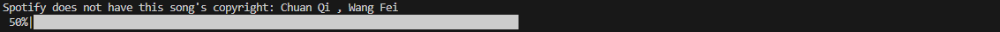

# 网易云音乐歌单迁移至Spotify

## 3首歌/秒(Spotify API最近变慢了)，保留原歌单顺序，支持任意歌单长度，全过程不产生费用

## 运行
1. 命令行输入`pip install -r requirements.txt`
2. [创建Spotify app(如没有)](https://developer.spotify.com/documentation/web-api/concepts/apps)
3. 替换`config.yml`里的所有值，说明如下:
    - `client_id`: Spotify app的Client ID
    - `client_id`: Spotify app的Client secret
    - `redirect_uri`: Spotify app的Redirect URIs中任意一个
    - `netease_playlist_id`: 想要迁移的网易云音乐歌单链接（推荐）或id，可通过网易云音乐Web端歌单链接或客户端分享-链接分享获取，比如链接为https://music.163.com/playlist?id=123456789&userid=xxxxxxxx，歌单id就是123456789
4. 命令行输入`python cli.py`
5. 浏览器弹窗提示登录Spotify
6. 等待运行即可，命令行会显示进度，Spotify无版权的歌曲也会在命令行提示(详见下方)

## "无版权"歌曲
由于之前版本经常会出现False Positive(如名字完全不同的歌被加到Spotify里)，现加入[year search query filter](https://developer.spotify.com/documentation/web-api/reference/search)缩小搜索范围(大幅减少，不代表完全没有False Positive了)，但由于网易云音乐歌曲的收录时间可能和Spotify不同，会有很多False Negative(Spotify明明有这首歌，但是程序说没有)，个人歌单大概每30首1首无版权，个人认为False Negative比False Positive好处理，因为后者不易察觉，前者只需手动再加一次就好了，以下两种类型的歌曲最容易触发“无版权”:
  - 年代久远的歌，Spotify显示原发行日期而网易云音乐显示开始有版权的日期，如
    - 
    - 
  - 歌名在网易云音乐和Spotify不一样的歌，如
    - 

其余无版权歌曲大概率是Spotify真没版权
 
为避免unicode exception，非英文的无版权歌曲会用字母提示

## OAuth 2.0 Client
虽然用的是Spotipy库，但之前写过一个适用于所有OAuth 2.0 app获取access token的基类，只需替换`OAuth2Client.py`中的`AUTHORIZATION_ENDPOINT`和`ACCESS_TOKEN_ENDPOINT`即可，详见[这篇博客](https://muyangye.github.io/2023/05/10/Netease-to-Spotify/) (不过抱歉是全英文的，因为本人是留学生在美国找工作所以就写了英文博客2333)

## 鸣谢
- [pyncm](https://github.com/mos9527/pyncm): 感谢老哥的网易云音乐API，真不理解为啥网易云音乐只开放API给合作方
- [spotipy](https://github.com/spotipy-dev/spotipy): 本来研究了挺久OAuth 2.0写好所有raw requests的基类了，然后发现了这个。。。
- [这个issue](https://github.com/Binaryify/NeteaseCloudMusicApi/issues/1121#issuecomment-774438040)